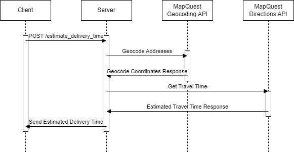

# Delivery Time Microservice

## Start Here
This microservice calculates the delivery time from one address to another utilizing HTTP requests. For the microservice to work, Axios and Node.js must be installed. 
```
npm install axios
```
## How to make requests
1. Prepare the origin address(restaurant address) and destination address(delivery address) in JSON format. The **test.js** file is provided and contains the example format for address information.
```
const requestData = {
    "restaurantStreet": "123 Rainbow Rd.",
    "restaurantCity": "Corvallis",
    "restaurantState": "OR",
    "restaurantZip": "12345",
    "deliveryStreet": "123 Main St.",
    "deliveryCity": "Corvallis",
    "deliveryState": "OR",
    "deliveryZip": "12345"
}
```
2. Send HTTP request to endpoint **/estimate_delivery_time**. The **test.js** file provided uses Axios for this within a local host (port 3000).
```
 axios.post('http://localhost:3000/estimate_delivery_time', requestData)
```

## How to receive data
1. Make sure program using the microservice defines same endpoint **/estimate_delivery_time** and parse the response data. The **test.js** file provided as an example extracts the delivery time from the data:
```
console.log('Estimated Delivery Time:', response.dta.estimatedDeliveryTime);
```

## UML Diagram

